# Obsidian BDT Snippets

A set of snippets to make the look of the default dark theme better.

## Snippets are:

### Font

Adds variable fonts and adjust them for better look in dark themes.

Specifically, it mitigates the famous negative [halation effect](https://fonts.google.com/knowledge/choosing_type/exploring_typefaces_with_multiple_weights_or_grades#using-weights-or-grades-for-readability).

- `bdt-roboto.css` - [Roboto Flex](https://fonts.google.com/specimen/Roboto+Flex) font
- `bdt-nunito.css` - [Nunito Sans](https://fonts.google.com/specimen/Nunito+Sans?query=Nunito+Sans) font

Example:

Default             |  With snippet (Roboto Flex)
:-------------------------:|:-------------------------:
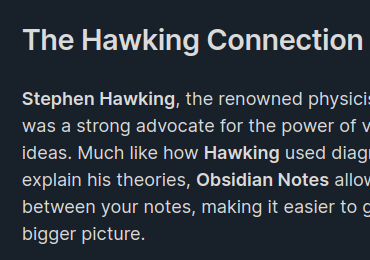 | 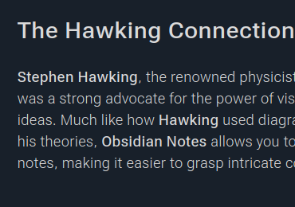

### Color

Color headings and lists for better reading.

- `bdt-colors.css`

Example:

Default             |  With snippet (colored headings and lists)
:-------------------------:|:-------------------------:
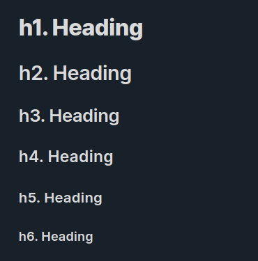 | 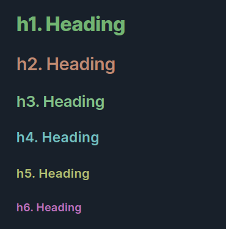
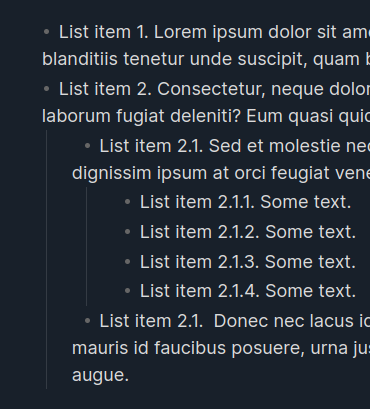 | 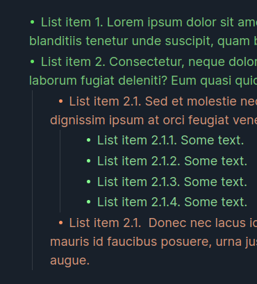

### Sizes

A fixed modular scale for sizing and spacing body text, headers and lists.

- `bdt-sizes.css`

Example:

Default             |  With snippet (sparse lists)
:-------------------------:|:-------------------------:
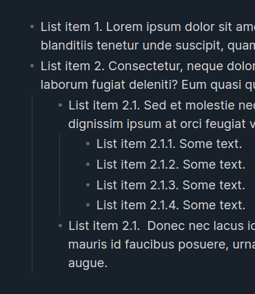 | 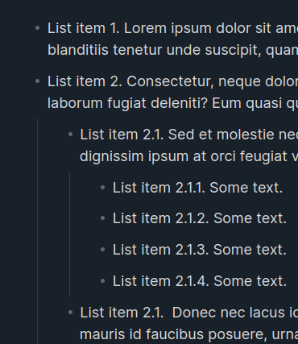

### UI

Small but useful UI enhancements: better list bullets, code blocks and a
current cursor position marker.

- `bdt-ui.css`

Example:

Default             |  With snippet
:-------------------------:|:-------------------------:
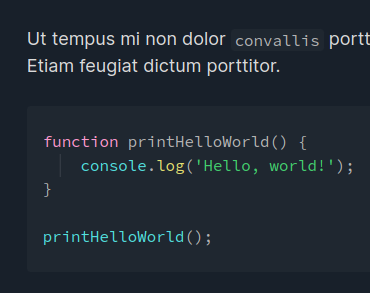 | 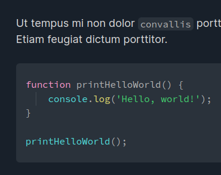
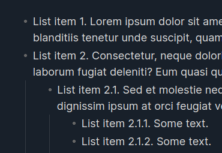 | 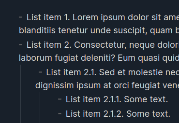
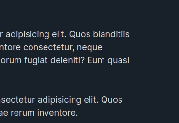 | 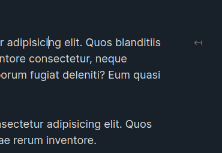

## Install

Check out the [latest release](https://github.com/OnkelTem/obsidian-bdt-snippets/releases/latest) page for release notes.

### Individual style snippets

Download snippets separately:

- [`bdt-roboto.css`](https://github.com/OnkelTem/obsidian-bdt-snippets/releases/latest/download/bdt-roboto.css)
- [`bdt-nunito.css`](https://github.com/OnkelTem/obsidian-bdt-snippets/releases/latest/download/bdt-nunito.css)
- [`bdt-colors.css`](https://github.com/OnkelTem/obsidian-bdt-snippets/releases/latest/download/bdt-colors.css)
- [`bdt-sizes.css`](https://github.com/OnkelTem/obsidian-bdt-snippets/releases/latest/download/bdt-sizes.css)
- [`bdt-ui.css`](https://github.com/OnkelTem/obsidian-bdt-snippets/releases/latest/download/bdt-ui.css)

and copy them into `<your-vault>/.obisidan/snippets/` directory.

### All snippets as one piece

Download zip-archive:

- [`obsidian-bdt-snippets.zip`](https://github.com/OnkelTem/obsidian-bdt-snippets/releases/latest/download/obsidian-bdt-snippets.zip)

and extra it into `<your-vault>/.obisidan/snippets/` directory.

## Usage

Go to `Settings > Appearance`, scroll to the **"CSS Snippets"** section and
enable `bdt-*` snippets that you like.

