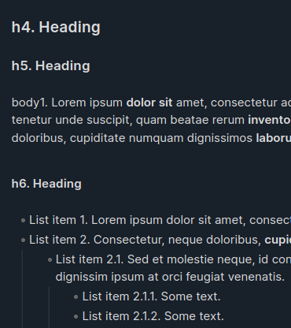
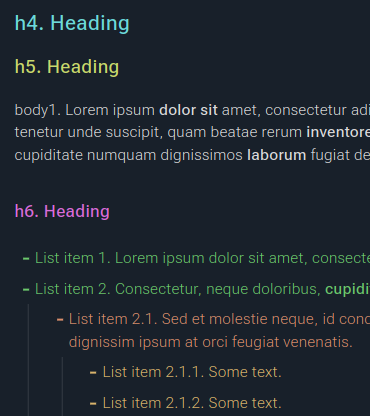
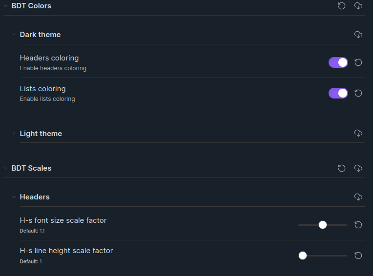
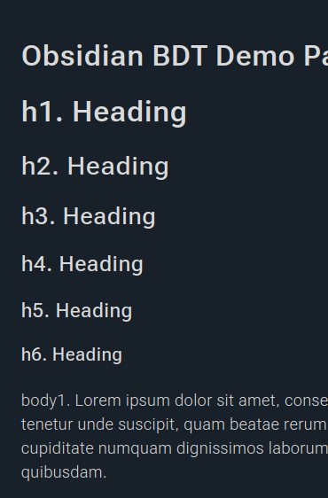
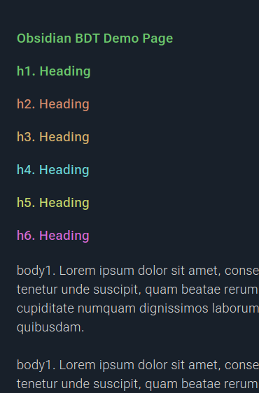

# Obsidian BDT Snippets

A set of Obsidian CSS snippets that make the notes look better, especially in dark themes.

The main goal is to improve fonts readability in dark themes and specifically 
to soften the [halation effect](https://fonts.google.com/knowledge/choosing_type/exploring_typefaces_with_multiple_weights_or_grades#using-weights-or-grades-for-readability).

In addition to fonts configuration, a few enhancements have been added, such as headings and list 
coloring, as they seem to make the text look more interesting.

Default             |  BDT styles
:-------------------------:|:-------------------------:
 | 

## Style Settings Plugin

All snippets are now configurable thanks to a brilliant Obsidian plugin [Style Settings](https://github.com/mgmeyers/obsidian-style-settings)!

Obsidian link: `obsidian://show-plugin?id=obsidian-style-settings`.

## Snippets

### Fonts

Provides a set of font styles to make it look nice in dark themes.

Currently only [Roboto Flex](https://fonts.google.com/specimen/Roboto+Flex) font is supported.

If you don't have it installed in your system, you can enable additional 
snippet `bdt-font-roboto-online.css` that imports the font from Google Fonts. 

Default             |  With snippet
:-------------------------:|:-------------------------:
 | 

### Colors

Headings and lists coloring for better reading.

Default             |  With snippet (colored headings and lists)
:-------------------------:|:-------------------------:
 | 
 | 

### Scales

Adds an exponential modular scale for sizing and spacing headers, body text and lists.
It uses the CSS [`pow()`](https://developer.mozilla.org/en-US/docs/Web/CSS/pow) function for building scales.

Scale factor = 1.1      |  Scale factor = 1
:-------------------------:|:-------------------------:
 | 

Default list view        |  With list spacing
:-------------------------:|:-------------------------:
 | 

### Other

A few other UI enhancements: list bullets, code blocks and a
current cursor position marker.

Default             |  With snippet
:-------------------------:|:-------------------------:
 | 
 | 
 | 

## Install

Check out the [latest release](https://github.com/OnkelTem/obsidian-bdt-snippets/releases/latest) page for release notes.

### Individual style snippets

Download snippets separately:

- [`bdt.css`](https://github.com/OnkelTem/obsidian-bdt-snippets/releases/latest/download/bdt.css)
- [`bdt-font-roboto-online.css`](https://github.com/OnkelTem/obsidian-bdt-snippets/releases/latest/download/bdt-font-roboto-online.css)

and copy them into `<your-vault>/.obisidan/snippets/` directory.

### All snippets as one piece

Download zip-archive:

- [`obsidian-bdt-snippets.zip`](https://github.com/OnkelTem/obsidian-bdt-snippets/releases/latest/download/obsidian-bdt-snippets.zip)

and extract it into `<your-vault>/.obisidan/snippets/` directory.

## Usage

Go to `Settings > Appearance`, scroll to the **"CSS Snippets"** section and
enable the `bdt.css` snippet. 

If you don't have the **Roboto Flex** font installed,
and you're fine with using its online version from Google Fonts, enable
the `bdt-font-roboto-online.css` snippet.

## Development

### CSS

Snippets are written in [Sass](https://sass-lang.com/) and located in `src/`.

### Style Settings

Style settings configurations live in dedicated YAML files: `src/_fonts.yaml`, `src/_colors.yaml` etc. 

It makes their editing more simple. In addition, there is a JSON Schema [`style-settings.schema.json`](style-settings.schema.json) that 
can be used by IDE to provide code completions.

The YAML files are included into corresponding Sass files using the 
regular Sass [`@import` at-rule](https://sass-lang.com/documentation/at-rules/import/) that is processed 
by a [custom Sass `importer`](https://sass-lang.com/documentation/js-api/interfaces/importer/) in the build script: [`scripts/build.js`](scripts/build.js#L15).

Specifically, it replaces such imports with `/* @settings <configuration>*/`-comments for  
the Style Settings plugin can work.

## TODO

- [ ] Push more things into configuration
- [ ] Add more variable fonts
- [ ] Make colors configurable
